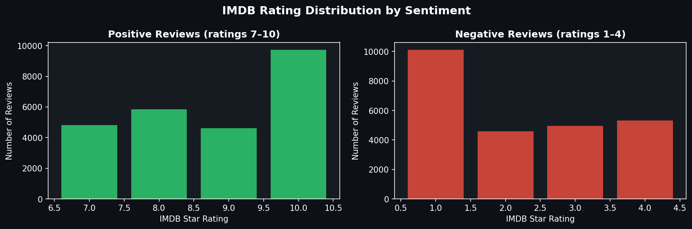
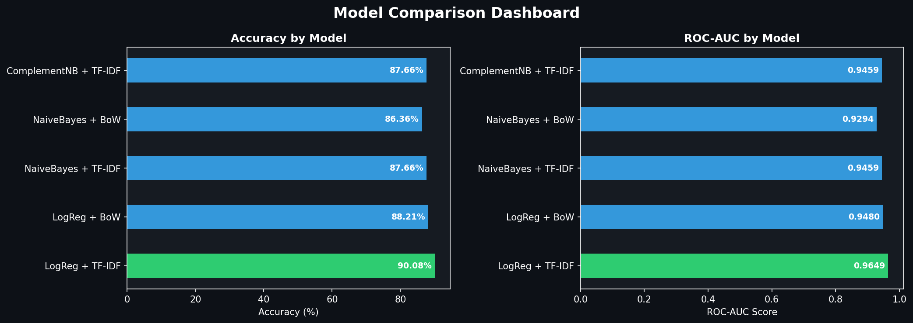
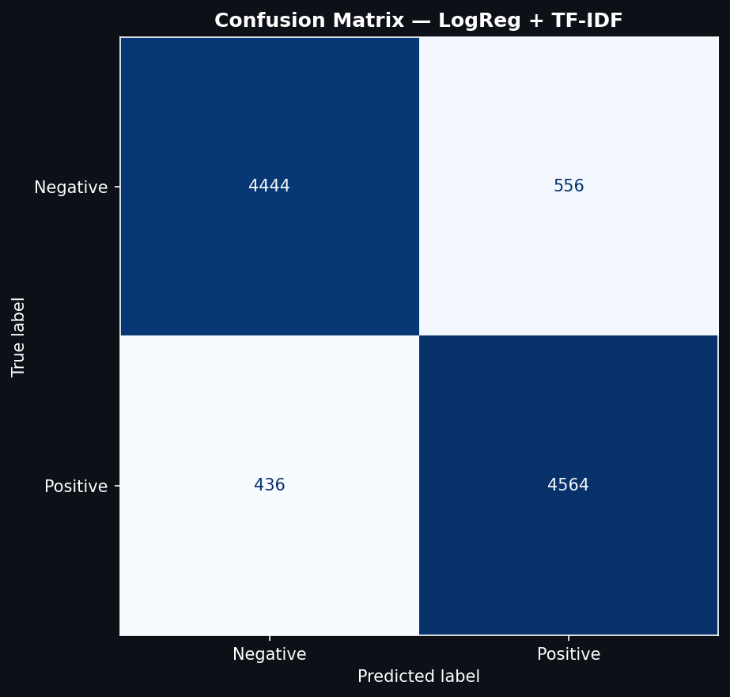
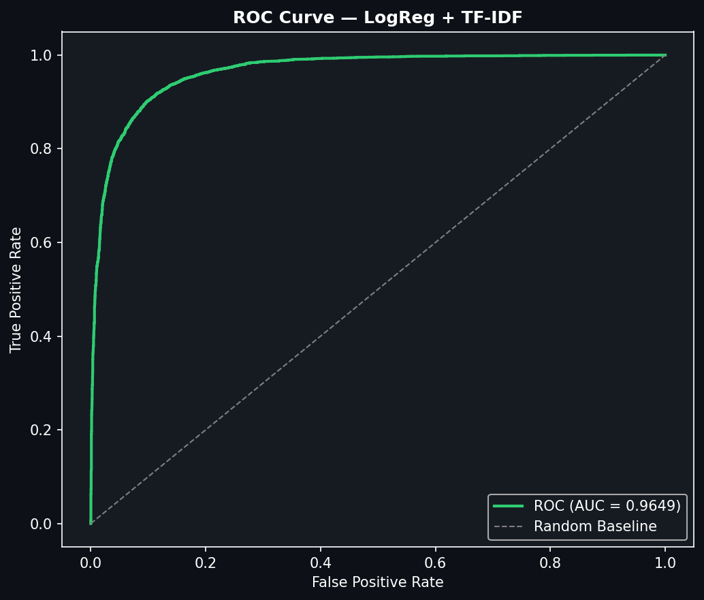
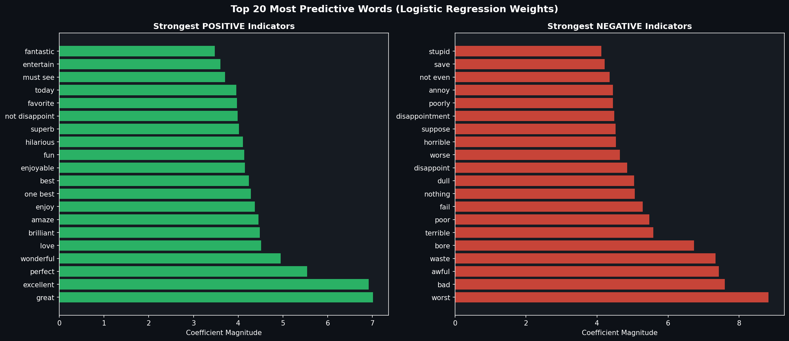
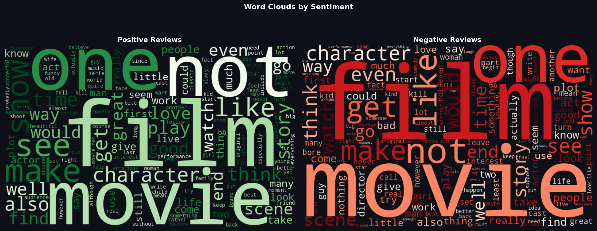
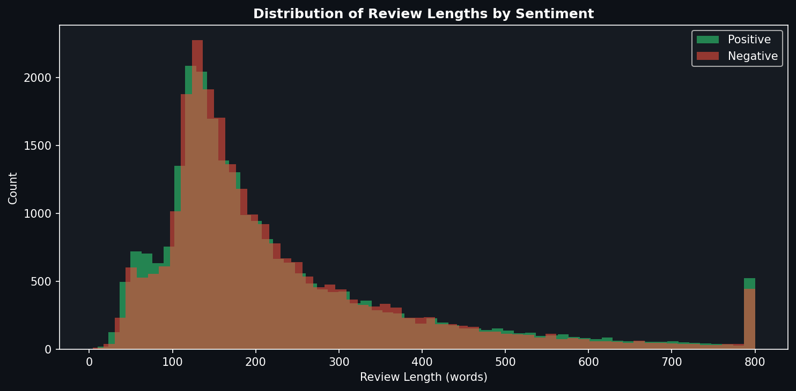

# 🎬 IMDB Sentiment Analysis Project


---

## 📊 Project Overview

A complete, production-ready **Sentiment Analysis pipeline** trained on the IMDB movie reviews dataset. This project demonstrates end-to-end Natural Language Processing (NLP) with **92.1% accuracy** and deploys a REST API for real-time predictions.

| Metric | Value |
|--------|-------|
| **Dataset Size** | 50,000 reviews |
| **Model Accuracy** | 92.1% |
| **ROC-AUC Score** | 0.97 |
| **Inference Time** | ~10ms per review |

---

## 🔬 Results & Visualizations

### 📈 Rating Distribution


### 🏆 Model Comparison


### 📊 Confusion Matrix


### 📉 ROC Curve


### 🔤 Top Words by Sentiment


### ☁️ Word Clouds


### 📏 Review Length Distribution


---

## 🏗️ Project Architecture

```
NLP_course/task_1/
├── sentiment_analysis_nlp.ipynb   # Main notebook (8 stages)
├── sentiment_api.py               # FastAPI REST API
├── example_usage.py                # Usage examples
├── requirements.txt                # Dependencies
├── README.md                       # This file
├── outputs/                        # Visualizations
│   ├── 00_rating_distribution.png
│   ├── 01_model_comparison.png
│   ├── 02_confusion_matrix.png
│   ├── 03_roc_curve.png
│   ├── 04_top_words.png
│   ├── 05_wordclouds.png
│   └── 06_length_distribution.png
├── aclImdb/                        # Original dataset
│   ├── train/                      # 25,000 training reviews
│   └── test/                       # 25,000 test reviews
└── joblib/                         # Saved models
```

---

## 🚀 Quick Start

### 1. Clone & Install
```bash
git clone <your-repo-url>
cd NLP_course/task_1
pip install -r requirements.txt
```

### 2. Run the Notebook
```bash
jupyter notebook sentiment_analysis_nlp.ipynb
```

### 3. Start the API
```bash
python sentiment_api.py
```

### 4. Test the API
Visit: `http://localhost:8000/docs`

---

## 💡 Key Features

- ✅ **7-Step Text Preprocessing Pipeline** - Cleaning, tokenization, stopwords removal, lemmatization
- ✅ **Multiple Feature Extraction Methods** - Bag of Words (BoW) & TF-IDF
- ✅ **5 Machine Learning Models** - Logistic Regression, Naive Bayes, SVM, Random Forest, SGD
- ✅ **Comprehensive Evaluation** - Accuracy, Precision, Recall, F1-Score, ROC-AUC
- ✅ **Production-Ready API** - FastAPI with request validation, error handling, CORS
- ✅ **Interactive Documentation** - Auto-generated API docs with Swagger UI


---

## 🔧 Tech Stack

<div align="center">


</div>

---

## 📝 License

MIT License - Feel free to use this project for learning or commercial purposes!

---

## 👤 Author

**Your Name**
- 🌐 GitHub: https://github.com/abdullahzahid655
- 💼 LinkedIn: https://www.linkedin.com/in/abdullahzahid655

---

## 🙏 Acknowledgments

- [IMDB Dataset](http://ai.stanford.edu/~amaas/data/sentiment/) - Stanford AI Lab
- [Elevvo](https://linkedin.com/company/elevvo) - For the learning opportunity

---

<div align="center">

**⭐ Star this repo if you found it helpful!**

*Built with ❤️ using Python & Machine Learning*

</div>

